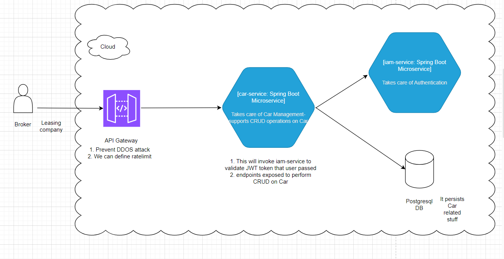

# Introduction
This service takes care of Car Management APIs using JWT token
This service will invoke iam-service using Feign client to validate JWT token

# Endpoints
1. Endpoints exposed in this swagger page http://localhost:8083/swagger-ui/index.html

# Credentials to login/authorize
1. Copy the generated token from 'iam-service' swagger page(/login endpoint)-(http://localhost:8080/swagger-ui/index.html)
2. Click Authorize and give the jwt token  to execute needed endpoints

# Architecture of this assessment(car-service)

# Technologies/Frameworks used in local
1. InteliJ Latest version
2. Java 17
3. Maven version 3.9.5
4. Spring Boot Version 3.1.0
5. Lombok
6. postgresql
7. Junit
8. Swagger(http://localhost:8083/swagger-ui/index.html)

# How to configure in local
1. Download repo from github
2. Refer # Technologies/Frameworks used in local to download needed software
3. Refer Postgresql installment section
4. Do 'mvn clean install'
5. Run spring boot main application
6. After app started, use http://localhost:8083/swagger-ui/index.html
7. Give JWT token generated from /login endpoint of iam-service(http://localhost:8080/swagger-ui/index.html)
8. Once you have Authorized using jwt token, click needed endpoint to perform required action

#  Postgresql installment section
1. Start the PostgreSQL server:
   pg_ctl start -D "C:\Program Files\PostgreSQL\16\data"
2. Login to the PostgreSQL database:
   psql -U postgres
3. After login execute below cmd to create DB:
   CREATE DATABASE carlease_db
4. Switch to DB using below cmd:
   \c carlease_db
5. Below cmd to create Table Car:
   CREATE TABLE car (
   id SERIAL PRIMARY KEY,
   make VARCHAR(255),
   model VARCHAR(255),
   version VARCHAR(255),
   numberOfDoors INTEGER,
   co2Emission DOUBLE PRECISION,
   grossPrice DOUBLE PRECISION,
   nettPrice DOUBLE PRECISION
   );

# Improvements can be made-Due to time constraints I could not do the below
1. By exposing this microservice to API Gateway , we can configure rate limit and prevent DDOS attack
2. Due to time constraints, I could not create docker for this.
3. Some validations on the user input fields could have been done by sanitizing the inputs fields to avoid/escape html characters
4. By integrating with Splunk, log can be monitored. Trace id and span id has to be enabled for all services
5. We can enable retry on 500 error when invoking iam-service

